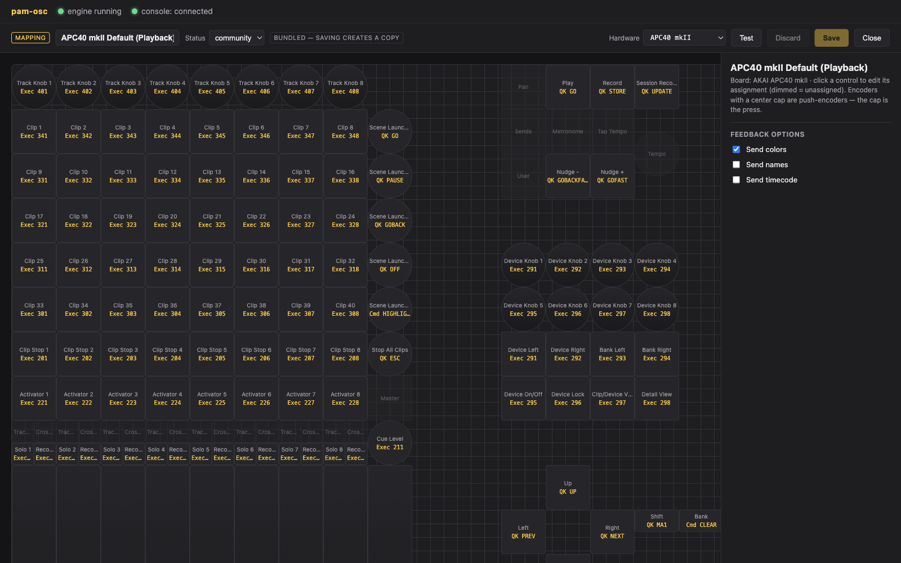
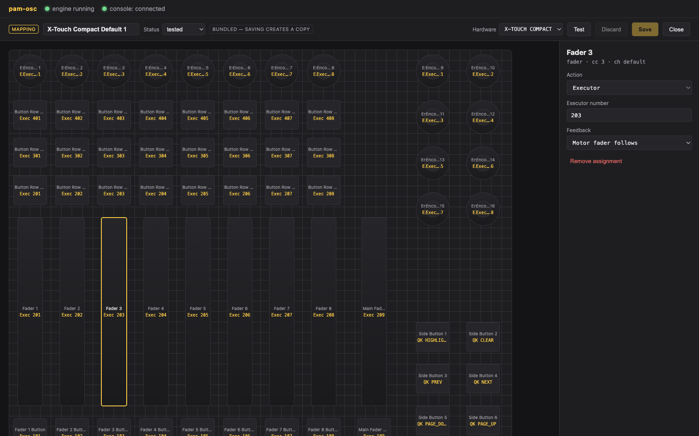
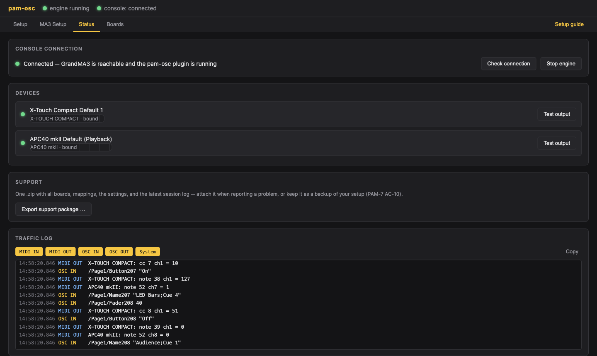
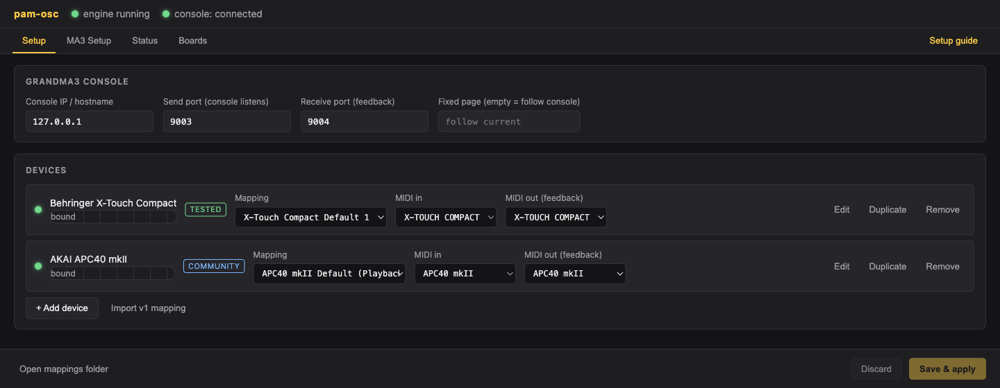
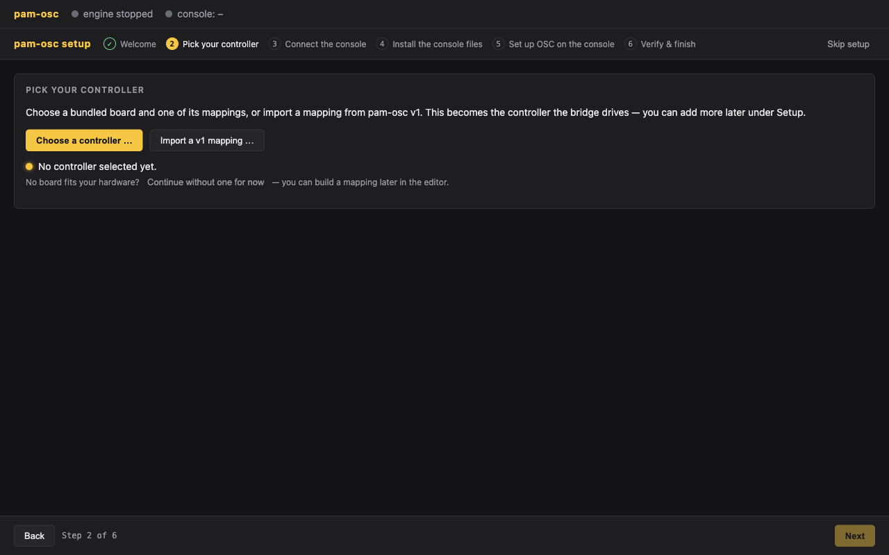
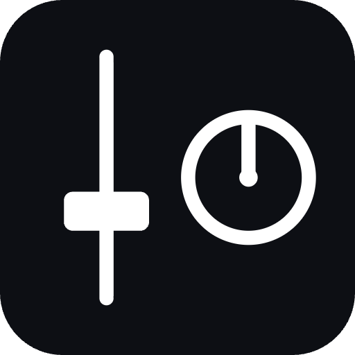

<div align="center">


### Turn affordable MIDI controllers into real GrandMA3 control surfaces.

Faders, encoders and buttons drive the executors on your current page — and the console talks back:
motor faders follow the show, LEDs mirror running sequences, displays show sequence, cue and color.

[](https://github.com/xxpasixx/pam-osc/releases)
[](https://github.com/xxpasixx/pam-osc/actions/workflows/ci.yml)
[](LICENSE)
[](https://discord.gg/4dcKjTH9Pm)


[**Download**](https://github.com/xxpasixx/pam-osc/releases) · [**Discord**](https://discord.gg/4dcKjTH9Pm) · [**Report a bug**](https://github.com/xxpasixx/pam-osc/issues) · [**Changelog**](CHANGELOG.md)

</div>

---

## 🎬 See it in action

<div align="center">
  <a href="https://www.youtube.com/watch?v=GCBT6tBH6DE" target="_blank">
    
  </a>
  <br>
  <sub>▶ Click to watch the demo on YouTube</sub>
</div>

## ✨ Why pam-osc?

MA hardware wings are great — and expensive. pam-osc gives pre-programmers, churches, small venues and freelancers **real tactile control with feedback** on hardware that costs a fraction of that.

- 🎚️ **Motor fader feedback** — faders follow page changes and playback in real time (full 14-bit resolution)
- 💡 **LED & color feedback** — buttons light up for running sequences; RGB pads show the sequence color
- 🖥️ **Scribble-strip displays** — sequence, cue and color on X-Touch displays
- 🎛️ **WYSIWYG playback** — executes what you see in the playback window (Master, Speed, Temp, Flash, …)
- ⌨️ **Commands, attributes & QuickKeys** — map any button to an MA3 command, encoder attribute or QuickKey
- 🔒 **DeskLock aware** — input is blocked while the console is locked; motor faders reset on unlock
- 🩺 **Built-in diagnostics** — connection check, plugin check, port diagnosis and a MIDI test mode, right in the app

## 🚀 pam-osc v2 — now a standalone app (beta)

v2 is a native desktop app for **macOS, Windows and Linux** — **no Open Stage Control, no terminal**. Download, open, enter the console IP, pick your device — done.

- **Setup wizard** that walks you from first launch to a moving fader
- **Visual mapping editor** — see your board in 2D, remap controls, add buttons/faders/encoders
- **Share mappings** with the community via export/import; **v1 mappings import** automatically
- **MA3 setup assistant** — installs the plugin into your local MA3 folder or exports it to a USB stick
- **Support package** — one click bundles everything we need to help you on Discord

> [!NOTE]
> v2 is in **beta**. v1.4 stays available and keeps working — you can switch back at any time.

### 📸 Screenshots

<p align="center">
  
  <br><sub><b>Visual mapping editor</b> — every control of your board in 2D, click to assign executors, commands or QuickKeys</sub>
</p>

<table>
  <tr>
    <td width="50%"><br><sub><b>Assign in seconds</b> — pick a control, choose the MA3 action and its feedback</sub></td>
    <td width="50%"><br><sub><b>Status at a glance</b> — console &amp; plugin check, bound devices, live MIDI/OSC traffic</sub></td>
  </tr>
  <tr>
    <td width="50%"><br><sub><b>Simple setup</b> — console IP, ports and as many boards as you like</sub></td>
    <td width="50%"><br><sub><b>First-run wizard</b> — from launch to a moving fader, step by step</sub></td>
  </tr>
</table>

### Download

Grab the latest build from the [**Releases**](https://github.com/xxpasixx/pam-osc/releases) page (beta builds are marked _Pre-release_). Available for:

- 🍎 **macOS** — Apple Silicon and Intel
- 🪟 **Windows** — 64-bit
- 🐧 **Linux** — AppImage (x86_64)

<details>
<summary><b>Installing an unsigned beta build</b> (macOS / Windows warnings)</summary>

<br>

The beta builds are not yet code-signed, so your system will warn you once. This is expected — the warnings disappear once signing is in place.

- **macOS:** open the `.dmg` and drag pam-osc into _Applications_. On first start macOS blocks it. Open _System Settings → Privacy & Security_, scroll down and click **Open Anyway** next to the pam-osc message, then confirm. If macOS says the app is "damaged", run this once in Terminal and start it again:
  ```sh
  xattr -cr /Applications/pam-osc.app
  ```
- **Windows:** when SmartScreen shows "Windows protected your PC", click **More info → Run anyway**.
- **Linux:** make the AppImage executable (`chmod +x pam-osc-*.AppImage`) and start it.

</details>

## 🎹 Supported hardware

These boards ship with the app — pick one and go. Any other MIDI controller can be added with the visual editor.

| Board                                         | Bundled mappings                                   | Status      |
| --------------------------------------------- | -------------------------------------------------- | ----------- |
| Behringer X-Touch Compact                     | Default 1                                          | ✅ tested   |
| Behringer X-Touch Compact (MC mode)           | Playback 1                                         | ✅ tested   |
| Behringer X-Touch Compact (relative encoders) | Relative 1                                         | 🧪 untested |
| Behringer X-Touch                             | Default 1 · Default 2 · Extension (exec 209–217)   | 🧪 untested |
| Behringer X-Touch Extender                    | Default 1 (exec 201–208)                           | 🧪 untested |
| Behringer X32 Compact (DAW Remote, MIDI CC)   | Default 1                                          | 🧪 untested |
| AKAI APC40 mkII                               | Default (Playback)                                 | 🧪 untested |
| AKAI APC mini                                 | Default 1 (Playback) · Default 2 (Command Section) | 🧪 untested |
| AKAI APC mini mk2                             | Controller                                         | 🧪 untested |
| Akai MPX16                                    | Default 1                                          | 🧪 untested |
| Novation Launchpad                            | Playback · TriFlats                                | 🧪 untested |
| Novation Launchpad Mini MK3                   | — (board only, build your own mapping)             | 🧪 untested |

✅ **tested** — verified hands-on with real hardware and GrandMA3 · 🧪 **untested** — ships with the app (mostly ported from v1) but not yet verified on real hardware in v2 · 🤝 **community** — shared by another user, works for its author. Tried an untested one? Tell us on Discord so we can mark it tested.

**Your board isn't listed?** Request it on [Discord](https://discord.gg/4dcKjTH9Pm) — post the board name, a photo and, if you have it, the manual or MIDI implementation chart. Boards with the most requests get bundled first. Or build the mapping yourself in the editor and share it — community mappings are very welcome.

## 🧩 How it works

```
 MIDI controller  ──MIDI──▶  pam-osc app  ──OSC/UDP──▶  GrandMA3 (console or onPC)
                 ◀─feedback─            ◀──feedback───  pam-OSC Lua plugin
```

The app translates MIDI into OSC for the console. A small Lua plugin on the GrandMA3 side sends the feedback back (fader positions, running sequences, names, colors). Tested with GrandMA3 **2.x**.

## 🆚 pam-osc compared

There are other ways to get MIDI hardware talking to GrandMA3. They are great tools — pam-osc's focus is a **much simpler setup** for exactly this job.

|                                | **pam-osc v2**                                                              | Chataigne + MA3 plugin                                                                    | Bome MIDI Translator Pro + MA3 plugin                                | grandMA3 onPC Fader Wing (official) |
| ------------------------------ | --------------------------------------------------------------------------- | ----------------------------------------------------------------------------------------- | -------------------------------------------------------------------- | ----------------------------------- |
| **Setup**                      | Download, setup wizard, pick your board — plugin install from the app       | Build every MIDI → OSC mapping yourself in Chataigne, set up a feedback plugin separately | Write your own translator rules, set up a feedback plugin separately | Plug in over USB                    |
| **Ready-made boards**          | 12 bundled boards + visual mapping editor                                   | — you build each mapping                                                                  | — you build each mapping                                             | n/a (it _is_ the hardware)          |
| **Motor fader & LED feedback** | Built in                                                                    | Possible — your own wiring + a community plugin                                           | Possible — your own rules + a plugin                                 | Native                              |
| **Troubleshooting**            | Connection, plugin & port checks, MIDI test mode, one-click support package | Chataigne's logger                                                                        | Bome's log                                                           | Supported by MA                     |
| **Flexibility**                | Focused on GrandMA3                                                         | Very high — many protocols beyond MA3                                                     | Very high MIDI processing                                            | Fixed hardware                      |
| **Cost**                       | Free & open source                                                          | Free & open source                                                                        | Commercial licence                                                   | Official MA hardware                |

**In short:** if you want maximum flexibility across many protocols, Chataigne or Bome are excellent. If you want your controller driving MA3 executors with feedback in minutes — without building the mapping logic yourself — that's what pam-osc is for. If you need a show-critical surface with official support, buy MA hardware.

## ⚠️ Using it in a show

pam-osc was primarily developed for **pre-programming sessions**, rehearsals and smaller events — and works well there. For a show, treat it as an **additional** control surface:

- Keep show-critical executors reachable on the console itself — pam-osc adds hands, it doesn't replace the desk.
- If the computer or the app stops, the console simply keeps running; only the MIDI controller stops doing anything.
- Test your exact setup (board, mapping, MA3 version) before the job — MA3 updates can change the Lua API the plugin relies on.
- Start the pam-osc plugin on the console once per session, and check the app's Status tab shows the console and the plugin as connected.
- In a multi-station MA3 session, run pam-osc against the **session master**.

The software is provided "as-is" without warranty of any kind. The author assumes no liability for issues, malfunctions or damages during live shows or production use. **Use at your own risk.**

## 🚧 Known limitations (v2 beta)

- **Most bundled boards are not yet verified on real hardware in v2** (see the table above) — tester reports are the fastest way to change that.
- **The plugin must be started on the console** once per session — MA3 has no plugin autostart.
- **Closing the app window stops the bridge.** A tray/background mode and "start at login" are planned.
- **Feedback is polled by the plugin** (~10× per second for the executors your mapping uses), so feedback is near-instant but not hardware-wing immediate. We are measuring the console load and will publish the numbers.
- **Builds are not code-signed yet** — see the install notes above.

## 💬 Help & community

- **Questions & setup help:** [Discord](https://discord.gg/4dcKjTH9Pm)
- **Bugs & feature requests:** [GitHub Issues](https://github.com/xxpasixx/pam-osc/issues) — attach the app's support package (Status tab), it helps a lot
- **What changed:** [CHANGELOG.md](CHANGELOG.md)

## 🛠️ Contributing

Contributions are welcome — new device mappings, bug fixes, translations of setup docs, testing on hardware you own.

```sh
git clone https://github.com/xxpasixx/pam-osc.git
cd pam-osc && git checkout v2
cd app && npm install
npm run dev        # start the app with hot reload
npm test           # unit + integration tests (virtual MIDI ports, fake MA3)
```

Development of v2 happens on the `v2` branch — please open pull requests against `v2`. `main` holds the stable v1.

## 📜 v1.4 (Open Stage Control)

<details>
<summary>Documentation for the legacy v1.4 setup</summary>

<br>

v1.4 runs as a module inside [Open Stage Control](https://openstagecontrol.ammd.net/). Follow the [Setup Instructions](https://github.com/xxpasixx/pam-osc/wiki/Setup) in the wiki. Tested with GrandMA3 **2.3.1.1**.

**MA3 OSC entry** — name the OSC entry in the MA3 OSC settings `pam-osc`; pam-osc then finds it no matter which line it is in. Without that name, line **2** is used (like in the setup guide). Since v1.4, fader values use the MA3-native **0-100** range — leave the fader range at its default.

**Troubleshooting** — check the terminal where Open Stage Control is running: on startup, pam-osc pings the console and tells you whether GrandMA3 is reachable and whether the plugin is running, with hints on what to check (send option, MA3 OSC settings, firewall). The check retries every 30 seconds. If no response arrives, pam-osc checks its local OSC input port and names the program blocking it (e.g. `UDP port 8080 is already used by "QLab"`).

Also watch your MIDI device on startup: pam-osc plays a short animation (running light across the LEDs, a wave through the motor faders, ~3.5 s). Nothing lights up → MIDI side (device name or connection). Animation plays but nothing else works → OSC/MA3 side.

**QuickKeys (changed in v1.4)** — buttons mapped with `quicKey` trigger QuickKeys named `pam-osc_<KEY>` (e.g. `pam-osc_CLEAR`). The plugin creates them automatically in the QuickKey pool on startup (from slot 1000, skipping occupied slots); they are stored in your showfile. **Breaking change:** run the v1.4 Lua plugin on the console at least once before using the new module version — otherwise QuickKey buttons do nothing.

**Known limitation** — MIDI feedback only works on channel 1.

</details>

## 📄 License

pam-osc is free software under the [GNU GPL-3.0](LICENSE).

<div align="center">
<br>

<br>
<sub>Made with ❤️ for the lighting community · If pam-osc helps you, give it a ⭐</sub>
</div>
